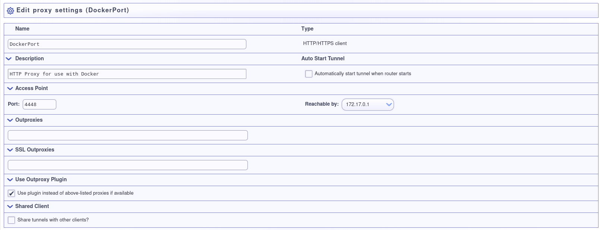

NextCloud over I2P, The Really Really Easy Way
==============================================

NextCloud is a tool for self-hosting services associated with many
so-called "Cloud Services" providers, without requiring the provider itself.
Cloud services providers participate in dragnet data collection and sharing
with partners in the surveillance industry, so avoiding the provider is an
important way of evading mass surveillance. However, it's not always that easy
to actually pull off.

What's tricky about it?
-----------------------

NextCloud makes both incoming **and** outgoing connections, as in, you can visit
the service and instruct it to make a connection to a remote server somewhere.
This is a feature, but it's also a risk to privacy because an authorized
user could make a request to a service they control in order to ascertain
information about the origin of the request. In this repository is a means of
configuring a PHP application to use an HTTP Proxy for outgoing connections on a
global basis, closing this privacy hole and also enabling the NextCloud server to
fully interact with I2P. It does this by use of a "DockerPort" which is a
neologism for a Proxy we set up specifically for use by Docker.

Additonally, in order to access your self-hosted services, you usually need to
have a fixed address somewhere. The easiest way to do this is usually to
use a *cloud services provider* somewhere to act as a rendezvous point, and
forward you to the address where the server actually is. This still requires
the cloud provider, it still leaks information to the cloud provider. If
you're brave and lucky, you'll learn to search for terms like "Dynamic DNS"
and eventually you're doing annoyingly brittle stuff with port forwarding on SOHO
networking equipment that maybe you remember the password for but you'll probably
look up in a manual you'll get as a PDF from the internet and worry, knowingly, 
at the implications of that. Because you know you didn't change that. In a year or
two your hobby will lead you to something called a "DHT" and you'll think "Dude
that sounds kind of complicated to get set up but once it's there that would be a
way better way to do this. All I'd need is a hosts file."\*

Hi. We're I2P. We've been doing this for a while. You can use ours.

Requirements:
-------------

 - **Docker** - Because this procedure uses Docker, it is possible to host NextCloud on most
  host operating systems.
 - **An I2P Distribution** - Any I2P will do, but this guide will supply screenshots from Java
  I2P.

Step One: Run Nextcloud in a container
--------------------------------------

This repository contains a Dockerfile which configures NextCloud for I2P using
a DockerPort which is on port `4448`. You can change this option by passing the
environment variable `http_proxy=` at run time. On Linux and OSX, build the 
container by cloning this reposity and running docker build in your `sh`. On
Windows, do the same thing, except in `powershell`.

Clone the repository using:

```sh
git clone https://github.com/eyedeekay/Nextcloud-over-I2P-on-Docker nextcloud-i2p
```

Then, change to the directory you just cloned using:

```sh
cd nextcloud-i2p
```

**This is the most important part.** Create a file named `.env` inside of `nextcloud-i2p`
directory. It should contain at least:

```sh
NEXTCLOUD_ADMIN_USER=anonadmin            ## The administrative username you want to use
    ## when you log into your NextCloud server
NEXTCLOUD_ADMIN_PASSWORD=examplepassword  ## The administrative username you want to use
    ## when you log into your NextCloud server
```

All of the other settings from [`https://hub.docker.com/_/nextcloud/`](https://hub.docker.com/_/nextcloud/)
will continue to work as well, in case you want to configure a MySQL database in order
to accomodate a larger number of users.

Build the repository using:

```sh
docker build -t nextcloud-i2p .
```

Now you're ready to run:

```sh
docker run -d --restart=always \
    -p 127.0.0.1:8080:80 \
    -v nextcloud:/var/www/html \
    --env-file .env
    --name nextcloud-i2p nextcloud-i2p
```

Your container is now running, but not accessible remotely yet, and it's also protected by
a password.

Step Two: Create an I2P "DockerPort"
------------------------------------

Nextcloud isn't able to make connections to I2P Sites yet, because there isn't a
DockerPort for it to use yet. To create one, go to [Hidden Services Manager](http://127.0.0.1:7657/i2ptunnelmgr)
and create an `HTTP/CONNECT` client. Configure it to be accessible on the
**Docker Bridge** which is usually going to be on the address `172.17.0.1`, and
on the port `4448`. No other changes are required, but you may wish to fine-tune them
to your liking.

 - 

Step Three: Create an I2P Server Tunnel
---------------------------------------

Now you're ready to make your I2P NextCloud service available over I2P. Go back to
[Hidden Services Manager](http://127.0.0.1:7657/i2ptunnelmgr) and this time, create
a `HTTP Server`. Configure it to forward `127.0.0.1:8080` to the I2P network, give
it a hostname, and save it. You may wish to fine-tune these setting as well, but
the defaults are safe for most people.

 - 
